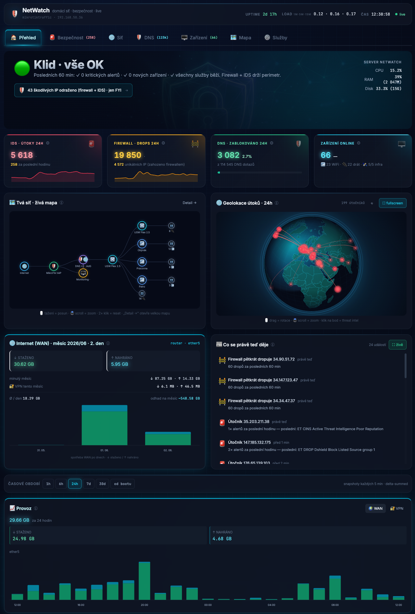
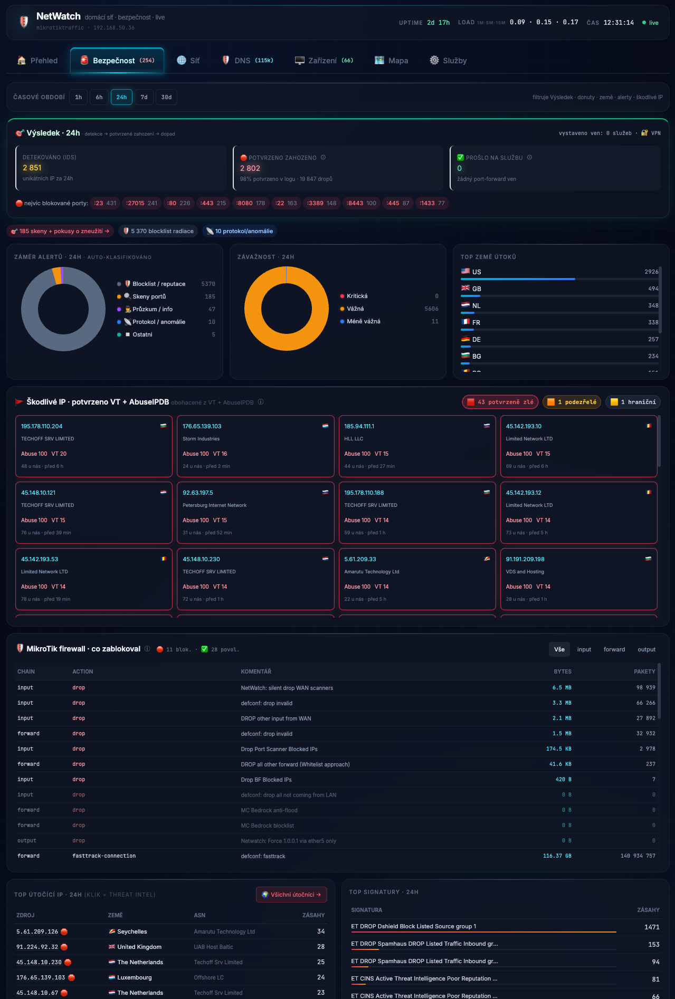
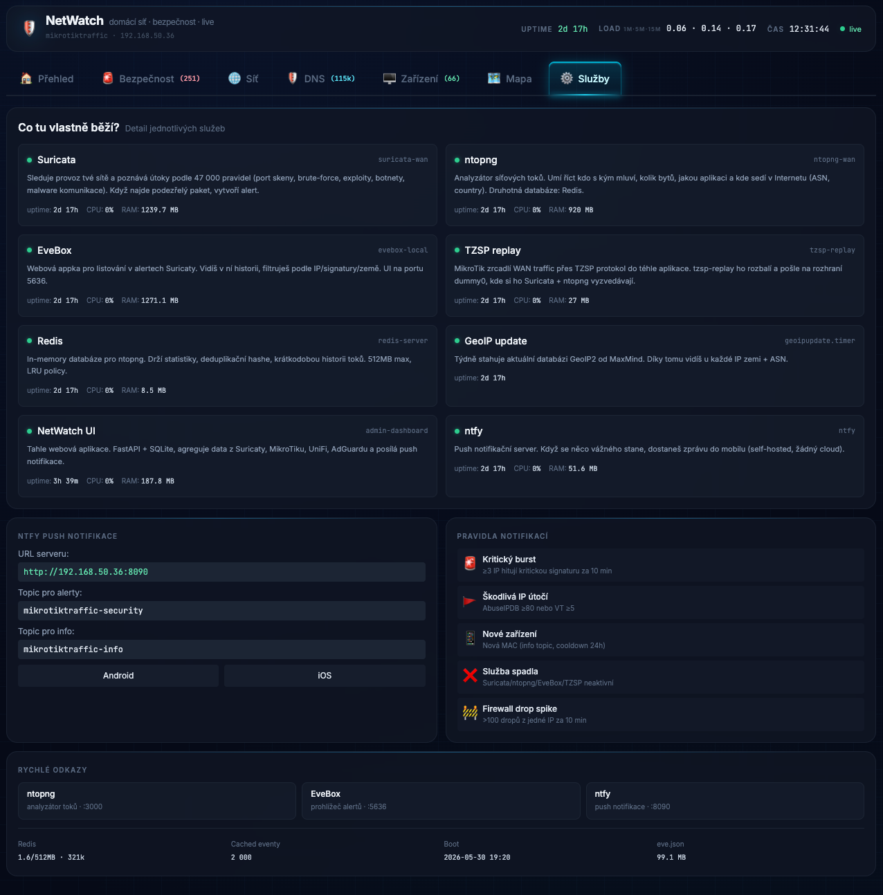

# NetWatch 🛡️

**A self-hosted, passive security dashboard for a home network.** It mirrors WAN
traffic to an IDS, correlates every detected attacker with the firewall's verdict,
enriches them with threat intelligence, and shows it all live — **without ever
sitting in the data path**.

> Built on a real MikroTik + UniFi + AdGuard homelab. The monitor is a *passive tap*
> (TZSP WAN mirror → Suricata on a dummy interface), so it sees everything and
> touches nothing.



## Why

Every public IP on the internet gets scanned around the clock. I wanted to **see**
that background radiation against my own line, **prove** the perimeter holds, and
learn the whole stack end-to-end. NetWatch answers one honest question per panel —
and refuses to show a number it can't actually measure.

## What it does

- **Passive IDS** — MikroTik mirrors the WAN port via TZSP → replayed into a dummy
  interface → **Suricata** (~50k ET rules). Zero inline risk.
- **Outcome correlation** — each IDS-detected attacker IP is matched against the
  firewall's drop log (shipped losslessly over **remote syslog**):
  *detected → confirmed-dropped → reached a service (0)*.
- **Threat intel** — attacker IPs enriched with **VirusTotal + AbuseIPDB**,
  geolocated with **MaxMind**, plotted on a 3D D3 attack globe.
- **Real per-device internet** — MikroTik **Traffic-Flow (NetFlow v9)** → a custom
  collector that attributes down/up to each device *across NAT* (postNAT field 226).
- **DNS** — **AdGuard Home** stats with a self-sampled hourly history, so any time
  window reconciles (not just AdGuard's fixed one).
- **Live network map** — curated topology (D3) + device inventory merged across
  MikroTik DHCP/ARP and UniFi.
- **Honesty principle** — if a metric can't be measured with confidence, it isn't
  shown (see ADR 0003).

## Screenshots

**Security** — detection → firewall outcome, intent/severity breakdown, threat-intel wall of shame:



**Services** — component health & quick links:



## Architecture

```
Internet ─▶ MikroTik (WAN) ──TZSP mirror──▶ dummy0 ──▶ Suricata ──▶ eve.json ─▶ EveBox
                 │                                                         └─▶ NetWatch (SQLite)
                 ├─ REST ─┐
UniFi · AdGuard · ntopng ─┼──▶   FastAPI backend   ──▶   Jinja2 + vanilla JS + D3 + Chart.js
VirusTotal · AbuseIPDB ───┘            │
MikroTik Traffic-Flow (NetFlow) ─▶ collector ─┘
MikroTik firewall log ─▶ remote syslog ─▶ collector
```

**Stack:** Python · FastAPI · SQLite (WAL) · D3 · Chart.js · Tailwind (compiled).
Background threads handle polling, enrichment, NetFlow, and syslog ingest.

## The interesting part — engineering decisions (ADRs)

The *why* lives as ADRs in [`docs/decisions/`](docs/decisions/):

| ADR | Decision |
|-----|----------|
| 0001 | Passive IDS via a TZSP WAN mirror (observe, don't inline) |
| 0003 | Traffic-metric **honesty** — don't show numbers you can't measure |
| 0004 | Alert **intent** classification (real signal vs blocklist radiation) |
| 0005 | IDS ↔ firewall **outcome** correlation (and why not Wazuh) |
| 0006 | Curated topology hierarchy |
| 0007 | Per-device internet via NetFlow (the cross-NAT attribution trick) |
| 0008 | DNS hourly history by sampling AdGuard's arrays |
| 0009 | Lossless firewall-drop capture via remote syslog |

> ADRs and runbooks are in Czech — it's my homelab's living documentation.

## What it deliberately does NOT do

- It's **passive** — it observes; the MikroTik firewall does the blocking.
- It only sees the **WAN mirror** — not tunnels (Cloudflare / Tailscale) or
  purely-internal LAN flows.
- It's a homelab tool: form-login + systemd hardening, but **put it behind a VPN or
  reverse proxy** — don't expose it raw.

## Run it

```bash
cp .env.example .env            # set your endpoints
pip install -r requirements.txt
# put credentials in $NETWATCH_CONFIG_DIR (or NETWATCH_* env vars)
uvicorn app:app --host 0.0.0.0 --port 8889
```

On the network side you'll want a MikroTik TZSP WAN mirror + Suricata, plus optional
Traffic-Flow (per-device) and remote syslog (firewall drops). See
[`docs/runbooks/`](docs/runbooks/) and [`docs/services/`](docs/services/).

## Note

Reference implementation from my homelab — IPs, hostnames, credentials and the
device catalog are **sanitized**. Adapt it to your own network. No warranty.

**License:** MIT.
